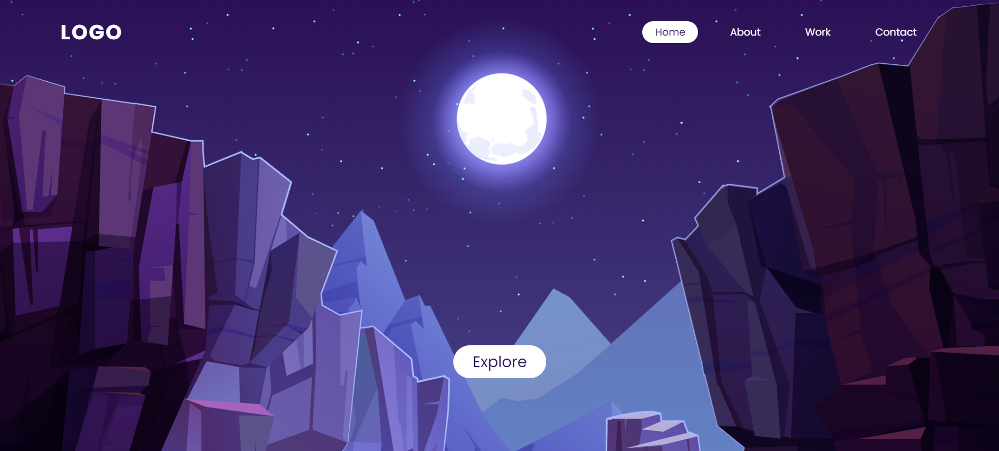
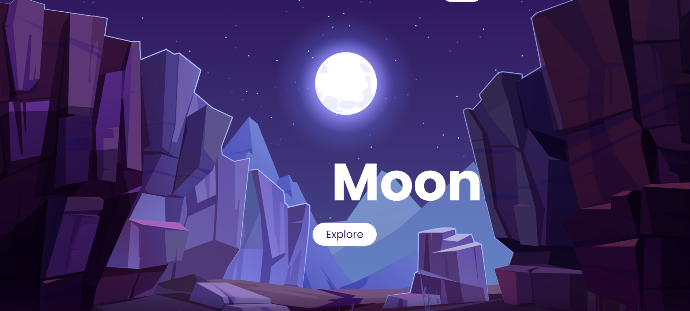
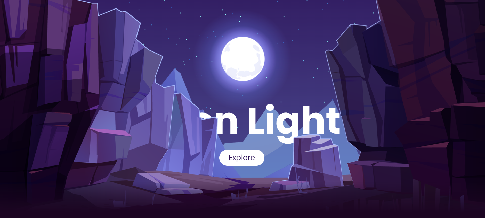
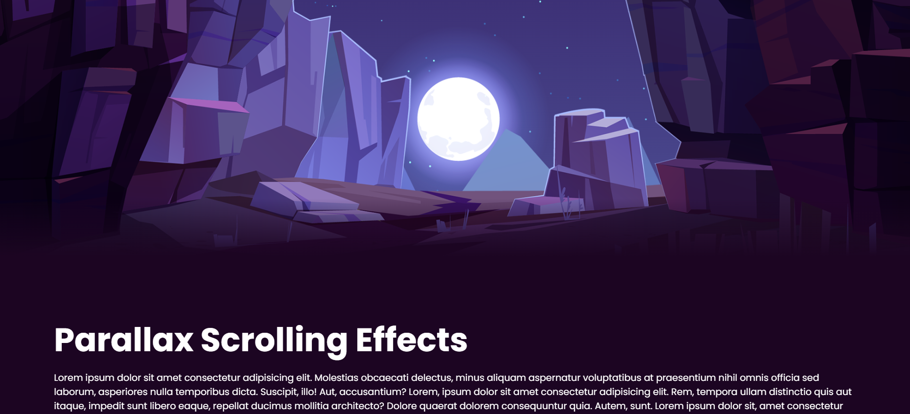

# Parallax Scrolling Website - Night Mountain View 

- Created using HTML, CSS, JavaScript
- Parallax effect: CSS, Vanilla JavaScript
- Vector illustration credit: [freepik](https://www.freepik.com/free-vector/mountains-cleft-view-from-bottom-night-scenery-landscape-with-high-rocks-full-moon-with-stars-glowing-peaks_13194970.htm#page=1&query=Scene&position=38)
- A learning project from [Online Tutorials](https://www.youtube.com/watch?v=1wfeqDyMUx4&t=63s)

### CCS Positioning 
Use ```position: relative``` in the parent element for relative positioning in child elements. For child elements, use ```position: absolute```, together with ```top```, ```bottom```, ```left``` and ```right``` to position them (in this case, the images) on screen. 

  

### JavaScript Parallax Effect  
```window.scrollY``` gives  the **number** of pixels that the document is currently scrolled vertically.  
<br>

```
function parallax() {
    let value = window.scrollY;
    stars.style.left = value * 0.25 + 'px';
    moon.style.top = value * 1.05 + 'px';
    mountains_behind.style.top = value * 0.5 + 'px';
    mountains_front.style.top = value * 0 + 'px';
    text.style.marginRight = value * 4 + 'px';
    text.style.marginTop = value * 1.5 + 'px';
    button.style.marginTop = value * 1.5 + 'px';
    header.style.top = value * 0.5 + 'px';
}

window.addEventListener('scroll', parallax)
```



<br>



### Using CSS to blend the border between sections 
The project uses ```linear-gradient``` property to blend the color between the sections. It is important to set the direction "to top" and the top should remain as "transparent" for the best possible blending effect. 

<br>

```
section::before {
    /*blending the border between sections*/
    content: '';
    position: absolute;
    bottom: 0;
    width: 100%;
    height: 100px;
    background: linear-gradient(to top, #1c0522, transparent);
    z-index: 1000;
}

```


<br>

Note: This project is aimed to practice parallax scorlling effect. Therefore, the navigation links will not lead to any external links nor pages. Also, the project is not resized for different screen sizes, it is best viewed on a **desktop/laptop screen**.  

**Click here to try out the parallax effect: [Project Demo](https://lihuicham.github.io/night-mountain-parallax/)**

**Click here to try out the parallax effect: <a href="https://lihuicham.github.io/night-mountain-parallax/" target="_blank">Project Demo**